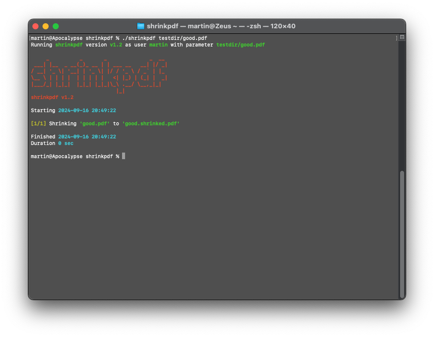

# shrinkpdf (Script to shrink PDF files)

## Description

Shrink PDFs in size

## Screenshot



## Usage

```Bash
#> ./shrinkpdf file1 file2 ...
```

## Background

The file is shrinked via ghostscript and the PDFSETTING for ebook.

```Bash
#> gs -sDEVICE=pdfwrite -dPDFSETTINGS=/ebook -q -o outputfile inputfile
```

## Development

The script "runtests" generates the directory "testdir" with some test files and runs the script on them:

```Bash
#> ./runtests
```

## License

MIT License, see "License.txt".

## Author

By domo
